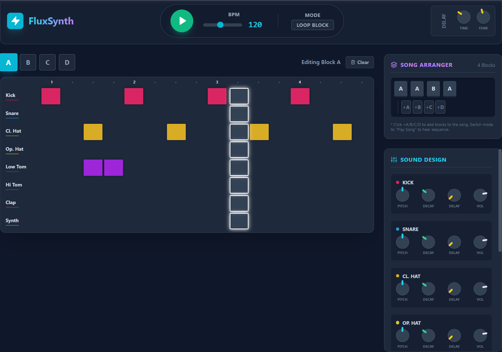

FluxSynth - Web Audio Drum Machine

FluxSynth is a fully functional, browser-based drum machine and synthesizer. Unlike traditional sample-based drum machines, FluxSynth uses the Web Audio API to generate sounds in real-time using oscillators and noise buffers. This means it requires no external audio files and offers deep control over sound sculpting.

It is built as a Single File Application, meaning the entire app (HTML, CSS, React Logic, and Audio Engine) lives inside one index.html file.

🚀 Quick Start

Download: Save the index.html file to your computer.

Run: Double-click index.html to open it in your web browser (Chrome, Firefox, Safari, or Edge).

Play: Click the Play button in the top header to start the audio engine.

No installation, Node.js, or server is required.

✨ Features

8 Synthesized Channels: Kick, Snare, Closed Hat, Open Hat, Low Tom, High Tom, Clap, and Synth Percussion.

Real-time Sound Design: Adjust Pitch, Decay, Volume, and Delay Send for every single channel.

16-Step Sequencer: Classic grid-based programming.

Pattern Blocks: 4 independent pattern slots (A, B, C, D) to create variations.

Song Mode: Arrange your pattern blocks into a playlist to create full tracks.

Global Effects: Master Delay unit with Time and Feedback controls.

🎛️ User Guide

1. The Sequencer

The main grid allows you to program beats.

Rows represent different instruments.

Columns represent time (16th notes).

Click a square to toggle a note on or off.

Visual Playhead: The white border indicates the step currently being played.

2. Pattern Blocks (A, B, C, D)

You have 4 "memory slots" for your beats, labeled A, B, C, and D.

Switching Blocks: Click the buttons labeled A, B, C, D above the sequencer grid.

Editing: When you select a block (e.g., "B"), the grid updates to show the pattern stored in that slot. Any changes you make are saved to "B" automatically.

Clear: Click the "Clear" button to wipe the current block's pattern.

3. Song Arranger (Playlist Mode)

This feature allows you to chain blocks together to play a full song.

Add Blocks: In the "Song Arranger" panel (right side), click +A, +B, etc., to add that block to the end of your playlist.

Reorder/Delete: The playlist shows the order of blocks. Click the small × on a block to remove it.

Activate: In the top header, switch the Mode toggle from "Loop Block" to "Play Song".

Loop Block: Plays the currently viewed block (A, B, C, or D) repeatedly.

Play Song: Cycles through your playlist sequence (e.g., A -> A -> B -> A).

4. Sound Design Controls

Customize the sound of each instrument using the knobs on the right sidebar.

Pitch: Tunes the frequency of the drum. (e.g., make the Kick deeper or the Toms higher).

Decay: Controls how long the sound lasts. (Short = snappy/tight; Long = booming/washed out).

Delay: Sends audio from this specific channel to the Global Delay effect.

Vol: Adjusts the volume mix.

Usage: Click and drag a knob up or down to adjust the value.

5. Global Controls

Located in the top header.

Play/Stop: Starts and stops the sequencer.

BPM: Slide to adjust the tempo (Beats Per Minute) from 60 to 200.

Global Delay:

Time: The speed of the echo.

Fdbk (Feedback): How many times the echo repeats.

🛠️ Technical Details

This project demonstrates how to build complex interactive audio applications using standard web technologies without a build step.

Audio: Native Web Audio API (Oscillators, GainNodes, BiquadFilters, DelayNodes).

UI Framework: React 18 (loaded via CDN).

Styling: Tailwind CSS (loaded via CDN).

Compilation: Babel Standalone (transpiles JSX in the browser).

modifying the Code

Since the code is contained in a single file, you can edit it using any text editor (VS Code, Notepad++, Sublime Text).

Open index.html in your editor.

Scroll down to the <script type="text/babel"> tag.

Modify the React components or the AudioEngine class.

Refresh your browser to see changes.

📄 License

This project is open source and available under the MIT License.

